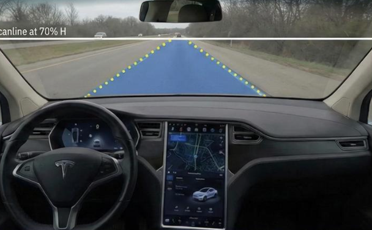
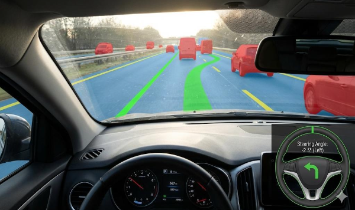
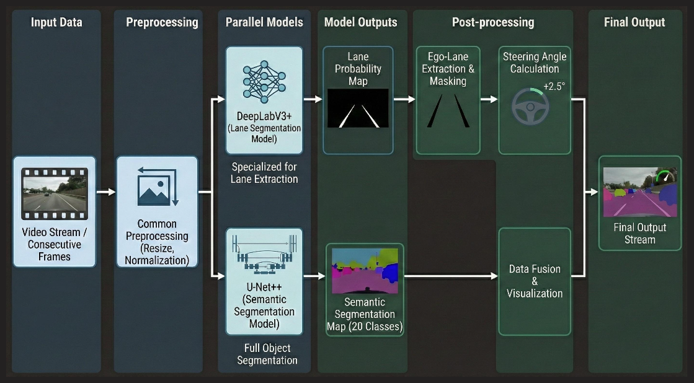

<div align="center">

# Demo

<div style="display: flex; justify-content: center; gap: 10px;">
  <div style="width: 45%;">
    
  </div>
  <div style="width: 45%;">
    
  </div>
</div>
</div>

<br>
<br>
<br>

<div align="center">

# 🚗 Road & Lane Segmentation

**자율주행을 위한 도로 및 차선 세그멘테이션**

<div style="display: flex; justify-content: center; gap: 20px;">
  
  
</div>

<br>
<br>

# 🏅 Tech Stack 🏅


</div>

<br>

## 👥 Team

|  |  |  |  |
| :--: | :--: | :--: | :--: |
| [함성민](https://github.com/raretomato) | [전승호](https://github.com/jeonseungho-glitch) | [주호중](https://github.com/hojoooooong) | [문국현](https://github.com/GH-Door) |

<br>

## 🎯 연구 목표

| # | 목표 | 설명 |
|:-:|:-----|:-----|
| 01 | **Driving-scene Semantic Segmentation** | 차선 및 주요 객체 인식을 위한 픽셀 단위 분류 |
| 02 | **Lane Segmentation 및 조향각 제어** | 검출된 차선 정보를 활용한 차량 조향각 예측 |
| 03 | **향후 기대 과제** | 차선과 객체 정보를 통합한 고도화된 제어 기법 |

<br>

## 📊 Dataset

### ETRI 멀티카메라 Segmentation Dataset
- 도로 환경 오브젝트 **68개 클래스** 라벨링
- 사이즈: **2048 x 1536**
- 데이터: Multi (Train 515, Test 182) + Mono (210)

### SDLane Dataset (차선 전용)
- 중앙~끝차선까지 번호 구분된 차선 라벨
- 사이즈: **1920 x 1208**
- 데이터: Train 39,096 / Test 3,853

<br>

## 🔄 System Pipeline

<div align="center">
  
</div>

<br>

## 🔧 문제 해결 과정

### 1️⃣ Class Imbalance 문제
> 상위 클래스(pole 14,000건)와 하위 클래스 간 극심한 불균형

**해결:** 의미론적 + 통계적 관점으로 **68 → 20 클래스 그룹핑** 적용, `inverse` class weights로 학습 안정화

---

### 2️⃣ 점선 차선 마스킹 실패
> Multi-class segmentation 후 OpenCV 로직으로 주행차선 마스킹 시, 점선 공백 구간 오류

**해결:** **병렬 처리 구조** 도입
- Multi-class segmentation (객체/도로)
- Lane segmentation (차선 전용)
- 최종 결과 통합하여 조향각 제어

---

### 3️⃣ Instance vs Semantic Segmentation
> 얇은 차선(Polyline)에서 Instance Seg 적용 시 미세 오차에도 IoU/Dice 급락

**해결:** **Semantic Segmentation**으로 전환, Boundary F1 (BF1@4px) 기준으로 위치 정밀도 평가

---

### 4️⃣ 조향 제어 불안정
> Stanley Controller + BEV 변환 시 점선 확산(Spreading) 문제

**해결:** 단순화된 **스캔라인 기반 조향 제어**
1. 다수 지점 스캔라인으로 차선 픽셀 감지
2. 차선 중심 오프셋 계산
3. 비선형 조향각 산출
4. EMA 필터로 스무딩

<br>

## 🚀 사용 방법

### 설치
```bash
# uv 설치 (없는 경우)
curl -LsSf https://astral.sh/uv/install.sh | sh

# 의존성 설치
uv sync
```

### 학습 & 평가
```bash
# 전체 파이프라인 (학습 → 평가)
python main.py --config configs/config.yaml

# 학습만
python main.py --skip-eval

# 평가만
python main.py --skip-train --checkpoint checkpoints/best.pt
```

### 차선 검출 & 조향 시각화
```bash
# 차선 모델 학습
python scripts/train_lane.py --config configs/lane_config.yaml

# 데모 (이미지/영상)
python scripts/demo_lane.py --checkpoint runs/lane/best.pt --image path/to/image.png
python scripts/demo_lane.py --checkpoint runs/lane/best.pt --video path/to/video.mp4
```

### Jupyter에서 사용
```python
from main import run_pipeline, train_only, eval_only

# 전체 파이프라인
results = run_pipeline(config_path="configs/config.yaml")

# 차선 검출 + 조향
from src.lane import LaneDetector
from src.control import SteeringController, LanePilot

pilot = LanePilot(LaneDetector("runs/lane/best.pt"), SteeringController())
result = pilot.process_frame(image)  # mask, steering, vis_frame
```

<br>

## 📝 License

This project is licensed under the MIT License.

---

<div align="center">
Made with ❤️ by Team Tesla-Buy-Me
</div>
